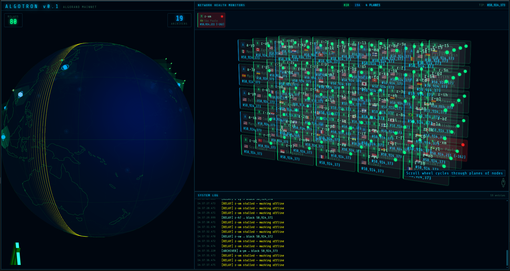

# Algotron

Real-time Algorand mainnet monitoring dashboard with an Encom boardroom aesthetic.

Discovers every relay and archiver node via DNS SRV records, geolocates them, and tracks their block heights live.

[](https://youtu.be/VQqEQATW-7w)

## Features

- **Live block tracking** — 1-second polling per node, shared across all clients
- **3D globe** — nodes plotted by geolocation with status-coloured dots
- **Status indicators** — synced / lagging / orange / offline based on lag from chain tip
- **Boot terminal** — Encom-style animated discovery sequence on first load
- **Multi-client** — new tabs receive an instant snapshot; no redundant polling

## Stack

| Layer | Tech |
|---|---|
| Backend | Node 22, Express, `ws`, ESM |
| Frontend | React 18, Vite 5, Three.js 0.163 |
| Transport | WebSocket (`/ws`) |
| Geo | ip-api.com batch (no key required) |
| DNS | SRV + A-record via `dns/promises` |

## Getting started

**Prerequisites:** Node 22+, pnpm (or npm)

```bash
# Install dependencies
pnpm install

# Run both backend and frontend in watch mode
pnpm dev
```

Or separately:

```bash
# Terminal 1 — backend on :3001
cd backend && npx tsx src/server.ts

# Terminal 2 — frontend on :5173
cd frontend && npx vite
```

Open [http://localhost:5173](http://localhost:5173).

## Project structure

```
algotron/
├── backend/src/
│   ├── server.ts        # Express + WebSocket, boot orchestration
│   ├── nodeMonitor.ts   # Shared singleton — node state, tip, polling
│   ├── session.ts       # Per-connection WS messaging wrapper
│   ├── nodeChecker.ts   # Binary search block discovery (HEAD requests)
│   ├── dns.ts           # SRV + A-record resolution
│   ├── geoip.ts         # ip-api.com batch geolocation
│   └── types.ts         # Shared TypeScript types
└── frontend/src/
    ├── App.tsx
    ├── hooks/
    │   └── useAppWebSocket.ts   # WS client + useReducer state
    └── components/
        ├── Globe.tsx            # Three.js globe
        ├── Dashboard.tsx
        ├── NodeGrid.tsx
        ├── NodeCard.tsx
        ├── BootTerminal.tsx
        └── TerminalPane.tsx
```

## Message protocol

The backend sends six message types over the WebSocket:

| Type | When |
|---|---|
| `boot_log` | Animated boot sequence lines |
| `boot_complete` | Frontend switches from terminal to dashboard |
| `node_discovered` | A new node has been found |
| `node_update` | A node's status or block height changed |
| `tip_update` | The chain tip advanced |
| `log` | Monitoring info/warn/error events |

## Node status

| Status | Colour | Condition |
|---|---|---|
| `synced` | green | lag ≤ 1 block |
| `lagging` | yellow | lag 2–3 blocks |
| `orange` | orange | lag > 3 blocks |
| `offline` | red | no response for 10+ poll rounds |
| `unknown` | grey | still in boot discovery |

## DNS bootstrap

- Relay SRV: `_algobootstrap._tcp.mainnet.algorand.net`
- Archiver SRV: `_archive._tcp.mainnet.algorand.net`
- Block URL: `http://{ip}:{port}/v1/mainnet-v1.0/block/{block_base36}`
